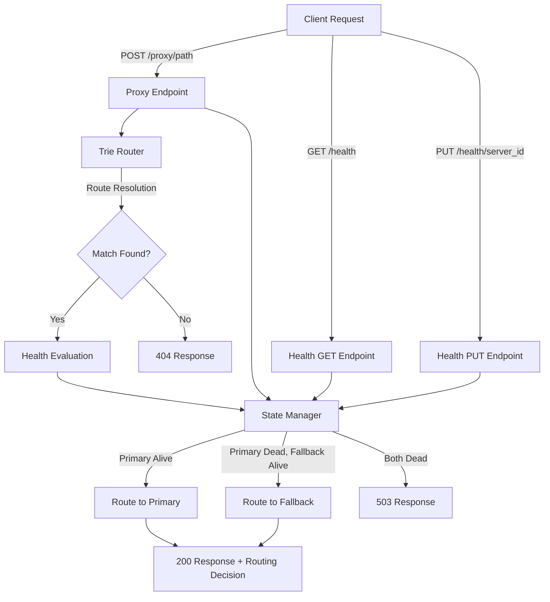
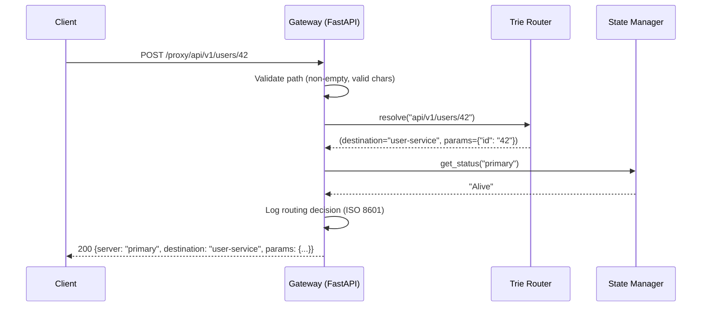

# Design Document

## Overview

This design describes the architecture and implementation of the NEURO-MESH Phase 1 Fault-Tolerant API Gateway. The system is a FastAPI-based asynchronous gateway that uses a custom Trie data structure for route resolution and a hash-map-based State Manager for server health tracking. The gateway exposes a universal proxy endpoint that intercepts requests, resolves routes, evaluates backend server health, and makes intelligent failover routing decisions.

The core design goals are:
- Efficient O(log n) path resolution via a custom prefix tree (Trie)
- O(1) server health lookups via Python dictionaries
- Deterministic failover logic: Primary → Fallback → 503
- Thread-safe concurrent access to mutable state via asyncio locks
- Clean separation of concerns between routing, state management, and request handling

## Architecture



### Component Interaction Flow



## Components and Interfaces

### 1. TrieNode

Internal node in the Trie data structure.

```python
class TrieNode:
    children: dict[str, "TrieNode"]     # static segment → child node
    dynamic_child: "TrieNode" | None     # single dynamic parameter child
    dynamic_param_name: str | None       # name of the dynamic parameter (e.g., "id")
    destination: str | None              # route destination (set only on terminal nodes)
```

### 2. Trie (Route Router)

Custom prefix tree for path resolution.

```python
class Trie:
    MAX_DEPTH: int = 20

    def insert(self, pattern: str, destination: str) -> None:
        """Insert a route pattern with its destination. Overwrites existing."""
        ...

    def resolve(self, path: str) -> tuple[str, dict[str, str]] | None:
        """Resolve a path. Returns (destination, params) or None."""
        ...

    @staticmethod
    def _normalize(path: str) -> str:
        """Strip leading/trailing slashes for consistent resolution."""
        ...
```

**Design Decisions:**
- Static children stored in a `dict[str, TrieNode]` for O(1) segment lookup at each level.
- A single `dynamic_child` field per node enforces one dynamic segment per level (standard REST convention).
- Resolution prioritizes static matches over dynamic at each level by checking `children` first.
- Path normalization strips leading/trailing slashes, making `/api/v1/` and `api/v1` equivalent.

### 3. ServerProfile

Data model for backend server records.

```python
from enum import Enum
from pydantic import BaseModel

class HealthStatus(str, Enum):
    ALIVE = "Alive"
    DEAD = "Dead"

class ServerProfile(BaseModel):
    server_id: str
    address: str
    status: HealthStatus
```

### 4. StateManager

Hash-map-based server health tracker with concurrency control.

```python
import asyncio

class StateManager:
    _servers: dict[str, ServerProfile]
    _lock: asyncio.Lock

    async def get_status(self, server_id: str) -> HealthStatus:
        """O(1) health lookup. Raises KeyError for unknown server_id."""
        ...

    async def set_status(self, server_id: str, status: HealthStatus) -> ServerProfile:
        """Update health. Raises KeyError for unknown server_id, ValueError for invalid status."""
        ...

    async def list_all(self) -> dict[str, ServerProfile]:
        """Return snapshot of all registered servers."""
        ...
```

**Design Decisions:**
- `asyncio.Lock` serializes read/write operations to prevent partial-update observation under concurrency.
- `dict` provides O(1) amortized lookup by server identifier.
- Initialized at startup with two servers: `primary` (Alive) and `fallback` (Alive).

### 5. Gateway Application (FastAPI)

```python
from fastapi import FastAPI

app = FastAPI()

# Endpoints:
# POST /proxy/{path:path}   → proxy_handler(path: str)
# GET  /health              → health_list()
# PUT  /health/{server_id}  → health_update(server_id: str, body: HealthUpdateRequest)
```

### 6. Input Validation

```python
import re

VALID_PATH_PATTERN: re.Pattern = re.compile(r'^[A-Za-z0-9\-._~/%]+$')

def validate_path(path: str) -> str | None:
    """Returns error message if invalid, None if valid."""
    ...
```

**Design Decisions:**
- Validation runs before Trie resolution to fail fast on malformed input.
- Regex allows unreserved characters, forward slashes, and percent-encoded sequences per RFC 3986.

## Data Models

### Request/Response Schemas

```python
from pydantic import BaseModel
from datetime import datetime

class HealthUpdateRequest(BaseModel):
    status: str  # Must be "Alive" or "Dead"

class ProxySuccessResponse(BaseModel):
    server: str
    destination: str
    params: dict[str, str]
    routing_decision: str
    timestamp: str  # ISO 8601

class ProxyErrorResponse(BaseModel):
    error: str
    path: str

class HealthListResponse(BaseModel):
    servers: dict[str, dict[str, str]]  # server_id → {address, status}

class HealthUpdateResponse(BaseModel):
    server_id: str
    status: str
```

### State Initialization

At application startup, the State Manager is seeded with:

| Server ID   | Address                   | Status |
|-------------|---------------------------|--------|
| `primary`   | `http://primary:8001`     | Alive  |
| `fallback`  | `http://fallback:8002`    | Alive  |

### Route Registration

Routes are pre-registered in the Trie at startup. Example configuration:

```python
routes = [
    ("/api/v1/users", "user-service"),
    ("/api/v1/users/{id}", "user-service"),
    ("/api/v1/orders", "order-service"),
    ("/api/v1/orders/{id}", "order-service"),
]
```

## Correctness Properties

*A property is a characteristic or behavior that should hold true across all valid executions of a system — essentially, a formal statement about what the system should do. Properties serve as the bridge between human-readable specifications and machine-verifiable correctness guarantees.*

### Property 1: Trie insertion round-trip

*For any* valid route pattern (with up to 20 segments, containing static and/or dynamic segments) and any destination string, inserting the pattern into the Trie and then resolving a path that matches that pattern SHALL return the correct destination identifier and a dictionary with correctly extracted dynamic parameter values.

**Validates: Requirements 2.2, 2.4**

### Property 2: Static over dynamic segment priority

*For any* Trie that has both a static segment and a dynamic segment registered at the same level of the same prefix, resolving a path whose segment exactly matches the static segment SHALL return the static route's destination, not the dynamic route's destination.

**Validates: Requirements 2.3**

### Property 3: Trailing slash normalization

*For any* registered route pattern and any matching path, resolving the path with a trailing slash SHALL yield the same result as resolving the path without a trailing slash.

**Validates: Requirements 2.6**

### Property 4: Duplicate pattern overwrite

*For any* route pattern, if it is inserted into the Trie with destination D1 and then inserted again with destination D2, resolving a matching path SHALL return D2.

**Validates: Requirements 2.8**

### Property 5: Depth limit enforcement

*For any* request path containing more than 20 segments, the Trie SHALL return None regardless of what routes are registered. *For any* valid route pattern with at most 20 segments, insertion and resolution SHALL succeed normally.

**Validates: Requirements 2.2, 2.9**

### Property 6: Non-matching path returns None

*For any* Trie with registered routes and *for any* path that does not match any registered pattern (differing in static segment values, having wrong segment count, etc.), the Trie SHALL return None.

**Validates: Requirements 2.5**

### Property 7: State Manager get/set round-trip

*For any* registered server identifier and *for any* valid health status (Alive or Dead), setting that status and then immediately retrieving it SHALL return the same status value that was set.

**Validates: Requirements 3.4, 3.5**

### Property 8: Unknown server identifier rejection

*For any* string that is not a registered server identifier, both get_status and set_status SHALL raise an error indicating the server is not registered.

**Validates: Requirements 3.6, 3.7**

### Property 9: Invalid status value rejection

*For any* string that is not "Alive" or "Dead", attempting to set a server's health status to that value SHALL raise a validation error.

**Validates: Requirements 3.8**

### Property 10: Failover routing decision

*For any* resolvable path, the proxy endpoint routing decision SHALL follow this precedence: if Primary_Server is Alive, select Primary; if Primary_Server is Dead and Fallback_Server is Alive, select Fallback; if both are Dead, return HTTP 503.

**Validates: Requirements 4.5, 4.6, 4.7**

### Property 11: Empty/whitespace path rejection

*For any* string that is empty or composed entirely of whitespace characters, the proxy endpoint SHALL return HTTP 400 without querying the Trie.

**Validates: Requirements 5.1**

### Property 12: Invalid character path rejection

*For any* path containing characters outside the allowed set (A-Z, a-z, 0-9, `-`, `.`, `_`, `~`, `/`, and percent-encoded sequences `%XX`), the proxy endpoint SHALL return HTTP 400 with an error message indicating which characters are invalid.

**Validates: Requirements 5.3**

### Property 13: Successful proxy response completeness

*For any* proxy request that results in a successful routing decision, the HTTP 200 response body SHALL contain the selected server identifier, the resolved route destination, the extracted path parameters dictionary, and a routing decision rationale string.

**Validates: Requirements 4.8**

### Property 14: Error proxy response completeness

*For any* proxy request that results in an HTTP 404 or HTTP 503 response, the response body SHALL contain both an error field describing the failure and the original request path.

**Validates: Requirements 4.10**

## Error Handling

### Error Classification

| Condition | HTTP Status | Response |
|-----------|-------------|----------|
| Empty/whitespace path | 400 | `{"error": "Request path must not be empty", "path": ""}` |
| Invalid path characters | 400 | `{"error": "Invalid characters in path: [chars]", "path": "<original>"}` |
| Route not found in Trie | 404 | `{"error": "No route matched", "path": "<original>"}` |
| Unknown server_id on PUT | 404 | `{"error": "Server not found: <id>"}` |
| Invalid status value on PUT | 422 | `{"error": "Status must be 'Alive' or 'Dead'"}` |
| Invalid/missing request body | 422 | `{"error": "Expected JSON body with 'status' field"}` |
| All servers dead | 503 | `{"error": "No healthy servers available", "path": "<original>"}` |
| Internal exception | 500 | `{"error": "Internal server error"}` |

### Error Handling Strategy

1. **Input Validation Layer**: Runs before any business logic. Validates path characters and emptiness. Returns 400 immediately on violation.
2. **Route Resolution Layer**: Trie returns None for unmatched paths. Gateway converts to 404.
3. **Health Evaluation Layer**: Checks primary then fallback. Returns 503 if both dead.
4. **Global Exception Handler**: FastAPI exception handler catches all unhandled exceptions, logs full stack trace internally, returns generic 500 to client.

### Concurrency Safety

- `asyncio.Lock` in State Manager prevents race conditions during concurrent health status reads and writes.
- The lock is acquired for both read (get_status, list_all) and write (set_status) operations to ensure no request observes a partially-updated state.
- Lock acquisition uses `async with self._lock:` pattern for automatic release.

## Testing Strategy

### Testing Framework

- **Unit Tests**: `pytest` with `pytest-asyncio` for async test support
- **Property-Based Tests**: `hypothesis` library for Python
- **HTTP Testing**: `httpx.AsyncClient` with FastAPI's `TestClient` for endpoint testing
- **Coverage**: `pytest-cov` for coverage reporting

### Property-Based Testing Configuration

Each property test will:
- Use the `hypothesis` library with `@given` decorator
- Run minimum 100 iterations per property (configured via `@settings(max_examples=100)`)
- Reference its design property via a tag comment: `# Feature: neuro-mesh-api-gateway, Property {N}: {title}`

### Test Categories

#### Unit Tests (Example-Based)
- Application startup and configuration defaults (Req 1.3, 1.5)
- State Manager initialization (Req 3.3)
- Log format verification (Req 4.9)
- Internal error handling without detail leakage (Req 5.2)
- GET /health response format (Req 6.1)
- Invalid request body handling (Req 6.5)

#### Property-Based Tests
- **Trie properties** (Properties 1–6): Test with generated route patterns and paths using Hypothesis strategies for valid path segments, dynamic params, and varying depths.
- **State Manager properties** (Properties 7–9): Test with generated server identifiers and status strings.
- **Routing logic properties** (Properties 10–14): Test with generated paths and health state combinations.

#### Integration Tests
- End-to-end proxy flow: register routes → set health states → send proxy requests → verify responses
- Concurrent access: multiple coroutines reading/writing state simultaneously
- Full failover scenario: primary alive → primary dies → fallback serves → fallback dies → 503

### Hypothesis Strategies (Custom Generators)

```python
from hypothesis import strategies as st

# Valid path segments (static)
static_segments = st.from_regex(r"[A-Za-z0-9\-._~]{1,20}", fullmatch=True)

# Dynamic parameter names
param_names = st.from_regex(r"[a-z_][a-z0-9_]{0,15}", fullmatch=True)

# Route patterns (mix of static and dynamic segments, 1-20 depth)
route_patterns = st.lists(
    st.one_of(static_segments, param_names.map(lambda p: f"{{{p}}}")),
    min_size=1, max_size=20
).map(lambda segs: "/" + "/".join(segs))

# Health status values
valid_statuses = st.sampled_from(["Alive", "Dead"])
invalid_statuses = st.text(min_size=1).filter(lambda s: s not in ("Alive", "Dead"))

# Server identifiers
valid_server_ids = st.sampled_from(["primary", "fallback"])
invalid_server_ids = st.text(min_size=1).filter(lambda s: s not in ("primary", "fallback"))
```

